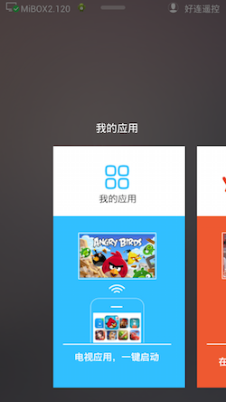
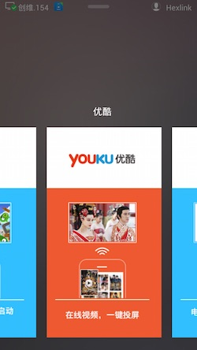
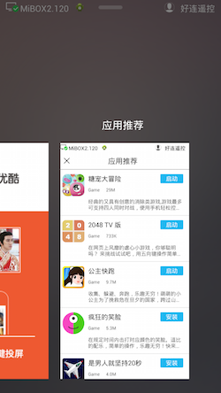

# 内嵌卡片

- order: 5
- category: hexlink

---

好连遥控拥有卡片式的设计，即功能或内容可以集成在一张卡片中展现。这给第三方开发者带来了极大的扩展性，合作伙伴只需要编写简单的移动端网页，或是在原有网页中加入接口，即可通过 JavaScript 调用好连遥控的原生方法与电视交互。





---

## 一个简单的例子

```javascript
<html>
  <head>
    <title>测试页面</title>
  </head>
  <body>
    好连遥控内嵌卡片 <br/>
    <input type="button" value="点击安装 2048" onClick="hexlink.installApk('naozine.games.tv2048','http://apps.hihex.com/tv2048/2048plus-signed.apk',18);" /><br/>
    <div id="content">内容显示</div>
  </body>
</html>
```

上面的例子中，`hexlink.installApk('packageName','apkUrl',1)` 就是我们提供的 API 接口，将好连遥控的原生能力提供给 Mobile Web Page 调用，使第三方可以专注内容提供，非常方便地与电视交互。

## API 列表

###一、应用管理接口

####1. 安装应用

```javascript
installApk(packageName,apkUrl,versionCode)
```

电视将开始安装从 `apkUrl` 获取的安装包

参数

|参数名|类型|描述|
|--:|---|---|---|
|packageName|**string**|安装包的包名，应与 AndroidManifest 中的相同|
|apkUrl|**string**|安装包所处的网络位置|
|versionCode|**int**|应用的版本号，应与 AndroidManifest 中的相同|

####2. 取消安装

```javascript
cancelInstall(packageName)
```

电视将取消 `packageName` 的安装

参数

|参数名|类型|描述|
|--:|---|---|---|
|packageName|**string**|安装包的包名，应与 AndroidManifest 中的相同|


###二、电视交互接口

####1. 投射视频

```javascript
castVideo(videoUrl)
```

电视将播放 `videoUrl` 所指定的流媒体

参数

|参数名|类型|描述|
|--:|---|---|---|
| videoUrl|**string**|视频的 URL 地址，该地址应该是支持格式中的一种|

支持的视频格式：`m3u8`

###三、社交接口

####1. 分享到应用

```javascript
shareMsg(shareJson)
```

手机将发起一次信息分享，其中 `shareJson` 参数应为以下格式的 JSON 字符串

|键名|类型|描述|
|--:|---|---|---|
| ShareType|**int**|分享类型|
| ShareTitle|**string**|分享的标题，显示在微信或其他分享框的标题栏上|
| ShareContent|**string**|分享的内容，作为正文分享到其他应用|
| ShareUrl*(可选)*|**string**|分享到微信朋友圈的链接 URL|
| ShareImage*(可选)*|**string**|分享的图片，以 base64 编码|

ShareType 表

|类型|值|描述|
|--:|---|---|---|
| 网页链接|**0**|以链接的形式分享|
| 图片|**1**|以图片的形式分享|
| 文字|**2**|以纯文本的形式分享|


> *注意*
>
> 在同时提供了 `ShareUrl` 和 `ShareImage` 并且将 `ShareType` 设置为 图片(`1`) 的情况下，可以修改分享链接到朋友圈的缩略图。
>
> 为了始终提供给用户一个通用的文本分享方式，请务必在必填项 `ShareContent` 填写有效信息，比如描述信息，即使在期望场景中可能不是必须的。


