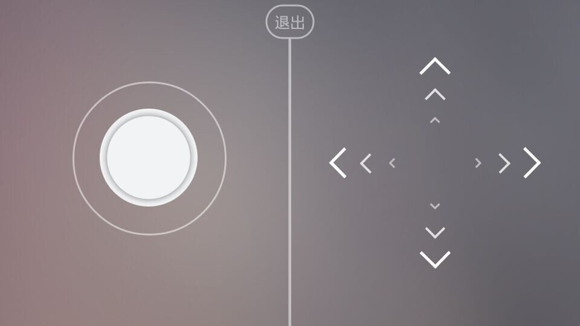

# 游戏操控
- order: 3
- category: hexlink

---
## 普通模式下游戏操控的一个简单例子
```java
// Java sample codes here
mGame.sbrcManager.setClientFactory(ClientFactories.singleton(new Client() {
    @Override
    public void onTap(final TapEvent event) {
        System.out.println("onTap点击事件");
        System.out.println(event.deviceId.toString()+"此为按下此事件的设备ID，每个设备ID是唯一的");
    }

    @Override
    public void onSwipe(final SwipeEvent event) {
        System.out.println("onswipe滑动事件");
        System.out.println(event.angle+“此为获取的角度”);
    }


    @Override
    public void onPan(final PanEvent event) {
        if (event.state == PanState.kBegin) {
            System.out.println("down");
        } else if (event.state == PanState.kEnd) {
            System.out.println("end");
        } else if (event.state == PanState.kMove) {
            System.out.println("move");
        }
    }

    @Override
    public void onConnect(final Identity identity) {
        //连接状态，通过参数identity可获取连接的设备ID的信息（设备号，用户昵称）等。
    }

    @Override
    public void onDisconnect(final Identity identity, final DisconnectReason reason) {
        //断开连接状态，通过参数identity可获取连接的设备ID的信息等。
    }
}));
```
## 横屏模式游戏操控的一个简单例子
```java
// 此示例展示一个横屏操控模式，屏幕分为左右两部分，左边是摇杆模式，右边是命令模式。
public class SampleStandardClient extends StandardClient {
    private final FrameLayout mParent;
    private final TextView mChild;
    private String mSeq;
    private final Activity mContext;
    private MoveChildHandler mHandler;
    private static final Random mRng = new Random();
    public SampleStandardClient(final Activity context, final FrameLayout layout) {
        // Initialize the standard client to use the landscape mode with a 1x2 grid.
        super(/*rows*/1, /*columns*/2, /*isLandscape*/true);
        // Use joystick on the left, and D-pad on the right.
        setModules(new Module[] {createJoystickModule(), createDpadModule()});
        // The rest are to set up the Android views.
        mParent = layout;
        mContext = context;
        mChild = new TextView(context);
        final int color = Color.HSVToColor(new float[] {mRng.nextFloat() * 360, 1, 1});
        mChild.setBackgroundColor(color);
        mChild.setTextColor(Color.BLACK);
        mChild.setTextSize(20);
        mChild.setGravity(Gravity.CENTER);
        mChild.setSingleLine(false);
        mChild.setText("(0, 0)\n.....");
        mSeq = ".....";
    }
    private final Module createJoystickModule() {
        return new JoystickModule() {
            @Override
            protected void onJoystickEvent(final PanState state, final float relX, final float relY) {
                // Set the actions to do when we receive a joystick event:
                mContext.runOnUiThread(new Runnable() {
                    @Override
                    public void run() {
                        switch (state) {
                        case kBegin:
                            // On begin, set the label to have white text.
                            mChild.setTextColor(Color.WHITE);
                            mHandler.startMoving();
                            break;
                        case kEnd:
                        case kCanceled:
                        case kUnknown:
                            // On end, revert the label to black text.
                            mChild.setTextColor(Color.BLACK);
                            mHandler.stopMoving();
                            break;
                        case kMove:
                            // While moving, change the velocity.
                            updateText();
                            mHandler.velocityX = relX * 0.1;
                            mHandler.velocityY = relY * 0.1;
                            Log.e("SBRC", ":" + relX + "," + relY);
                            break;
                        }
                    }
                });
            }
        };
    }
    private final Module createDpadModule() {
        return new DpadModule() {
            @Override
            protected void onDpadEvent(final Command command) {
                // Set the actions to do when we receive a dpad event.
                // We update the text of the label.
                final String newString = mSeq.substring(1);
                final String commandString;
                switch (command) {
                case kClick:
                    commandString = "\u25cb";
                    break;
                case kLongPress:
                    commandString = "\u25cf";
                    break;
                case kLeft:
                    commandString = "\u2190";
                    break;
                case kRight:
                    commandString = "\u2192";
                    break;
                case kUp:
                    commandString = "\u2191";
                    break;
                case kDown:
                    commandString = "\u2193";
                    break;
                default:
                    commandString = "?";
                }
                mSeq = newString + commandString;
                mContext.runOnUiThread(new Runnable() {
                    @Override
                    public void run() {
                        updateText();
                    }
                });
            }
        };
    }
    @Override
    public void onConnect(final Identity identity) {
        super.onConnect(identity);
        // Display a new label when a client connected.
        mContext.runOnUiThread(new Runnable() {
            @Override
            public void run() {
                mHandler = new MoveChildHandler(mChild);
                mHandler.attach(mParent);
            }
        });
    }
    @Override
    public void onDisconnect(final Identity identity, final DisconnectReason reason) {
        super.onDisconnect(identity, reason);
        mContext.runOnUiThread(new Runnable() {
            @Override
            public void run() {
                mHandler.stopMoving();
                mParent.removeView(mChild);
            }
        });
    }
    private void updateText() {
        mChild.setText("(" + (int) mHandler.velocityX + ", " + (int) mHandler.velocityY + ")\n" + mSeq);
    }
}
```

把上述代码复制到一个新的 xxx 文件中，然后...
## 就这些？！
就是这么简单！
