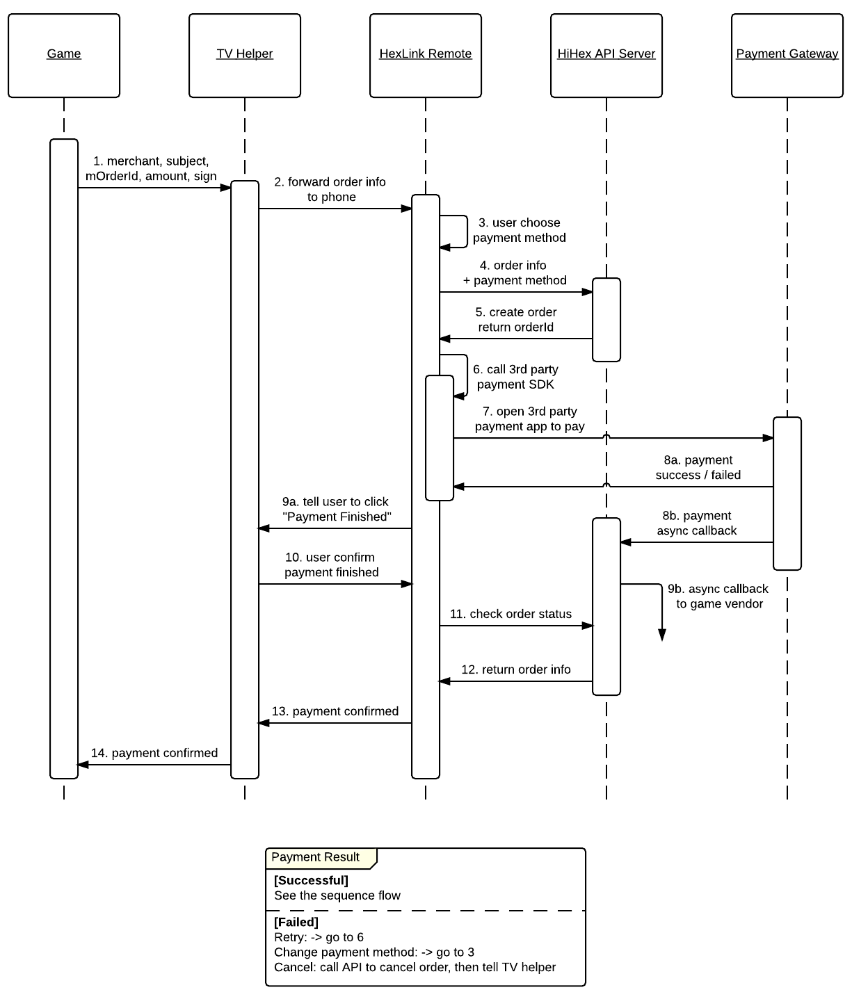

# 电视支付

- order: 4
- category: hexlink

---

> More power comes more responsibility. 「 Spider Man 」2012

我相信，只是操控几个游戏一定不是你的追求，我们还要赚钱啊！HexLink 的支付 SDK 可以让你做得更多。

---

游戏开发者在集成电视支付 SDK 前，需联系 HiHex 团队进行注册。注册时提供以下信息：

- 开发者名称（个人名称或公司名称均可）
- Email 地址
- 游戏服务器异步通知 URL 地址

HiHex 会提供 `merchantId` 和 `merchantSecret` 给开发者，开发者在调用 API 时需使用 `merchantSecret` 进行签名。该参数应保密，不可透露给第三方。

## 支付流程

## 支付 SDK

_**@kennytm Please edit this part**_

游戏在发起支付事件时，调用 HexLink TV 的 SDK，传递以下参数（粗体为必传参数）：

| Field              | Type           | Description                       | Default | Example                    |
|--------------------|----------------|-----------------------------------|---------|----------------------------|
| **merchantId**   | int(11)        | HiHex 提供的 merchantId            | -       | 1001                       |
| merchantOrderNo    | varchar(255)   | 游戏开发方的订单号                   | NULL    | 'UM20150321000000012'      |
| orderType          | enum           | 订单类型，可选“充值”、“道具”、“会员”等 | NULL    | 'CREDIT','PROP','VIP'      |
| **amount**       | decimal(10,1)  | 订单金额，人民币保留一位小数           | 0.0     | 1.5 或 10.0                |
| **subject**      | varchar(500)   | 购买物品描述                        | NULL    | '激光炮'                    |
| remarks            | varchar(255)   | 购买物品备注                        | NULL    | '使用激光炮可直接摧毁敌方坦克'  |
| extraData          | text           | 游戏开发者自身需要使用的更多参数，以 JSON 字符串格式传送 | NULL    | {serverId: 1, productName: 'smTank'} |
| **signature**    | varchar(64)    | 除 signature 自身外的所有参数，按本表格顺序排列，最后加上开发者的 signSecret，进行 SHA1 摘要 | NULL    | '0355E7F3AF50A06B31B108C8D5EF8A1'|

注： `signature` 进行签名摘要前，需进行 url encode。非必须的参数也要参与签名摘要，值为空。例

	signature = sha1('merchantId=1001&merchantOrderNo=UM20150321000000012&orderType=&amount=10&subject=%E6%BF%80%E5%85%89%E7%82%AE&remarks=%E4%BD%BF%E7%94%A8%E6%BF%80%E5%85%89%E7%82%AE%E5%8F%AF%E7%9B%B4%E6%8E%A5%E6%91%A7%E6%AF%81%E6%95%8C%E6%96%B9%E5%9D%A6%E5%85%8B&extraData=%7BserverId%3A+1%2C+productName%3A+%27test%27%7D&signSecret=test');
 
## SDK 返回值 

_**@kennytm Please edit this part**_

参考第一节的支付流程图，在游戏调用 HiHex SDK 方法后，HexLink TV 会将游戏开发者的数据传送到手机，唤起 HexLink 手机端的支付方法。用户在手机端完成支付流程，支付结果返回 HexLink TV 端，SDK 再将结果返回给游戏。返回值为 JSON 格式，包含以下字段

| Field              | Type           | Description                       | Default | Example                    |
|--------------------|----------------|-----------------------------------|---------|----------------------------|
| orderId            | int(11)        | HiHex 方的订单号                    | -       | 1001                       |
| merchantOrderNo    | varchar(255)   | 游戏开发方的订单号                   | NULL    | 'UM20150321000000012'      |
| amount             | decimal(10,1)  | 订单金额，人民币保留一位小数           | NULL    | 10.0                       |
| paymentMethod      | enum           | 支付渠道                           | NULL    | 'UMENG','ALIPAY','WECHAT'   |
| completeTime       | timestamp      | 订单完成时间                        | NULL    | '2015-03-12 12:34:53'      |
| status             | enum           | 订单状态，“成功”、“失败”、“取消”      | NULL    | 'SUCCESS','FAILED','CANCELED'      |
| errorMsg           | text           | 订单不成功时的错误信息，JSON 格式      | NULL    | {errorCode:1, errorMessage:"something wrong"}   |

## 服务器异步通知

在用户支付成功后，除了 SDK 会即时返回支付结果外，HiHex 还会异步地以主动的方式将相关结果通知给游戏服务器。游戏服务器的异步通知 URL 地址由游戏开发商在 HiHex 注册时提供。通知参数如下

| Field              | Type           | Description                       | Default | Example                    |
|--------------------|----------------|-----------------------------------|---------|----------------------------|
| merchantId         | int(11)        | HiHex 提供的 merchantId            | -       | 1001                       |
| merchantOrderNo    | varchar(255)   | 游戏开发方的订单号                   | NULL    | 'UM20150321000000012'      |
| orderType          | enum           | 订单类型，可选“充值”、“道具”、“会员”等 | NULL    | 'CREDIT','PROP','VIP'      |
| amount             | decimal(10,1)  | 订单金额，人民币保留一位小数           | 0.0     | 1.5 或 10.0                |
| subject            | varchar(500)   | 购买物品描述                        | NULL    | '激光炮'                    |
| remarks            | varchar(255)   | 购买物品备注                        | NULL    | '使用激光炮可直接摧毁敌方坦克'  |
| extraData          | text           | 游戏开发者自身需要使用的更多参数，以 JSON 字符串格式传送 | NULL    | {'serverId': 1, 'productName': 'smTank'} |
| orderTime          | timestamp      | 订单发起时间                        | NULL    | '2015-03-12 12:34:53'      |
| completeTime       | timestamp      | 订单完成时间                        | NULL    | '2015-03-12 12:34:53'      |
| paymentMethod      | enum           | 支付渠道                           | NULL    | 'UMENG','ALIPAY','WECHAT'  |
| status             | enum           | 订单状态，“成功”、“失败”、“取消”      | NULL    | 'SUCCESS','FAILED','CANCELED'      |
| errorMsg           | text           | 订单不成功时的错误信息，JSON 格式      | NULL    | {errorCode:1, errorMessage:"something wrong"}   |
| signature          | varchar(64)    | 支付请求时提交的 SHA1 摘要 | NULL    | '0355E7F3AF50A06B31B108C8D5EF8A1'|

