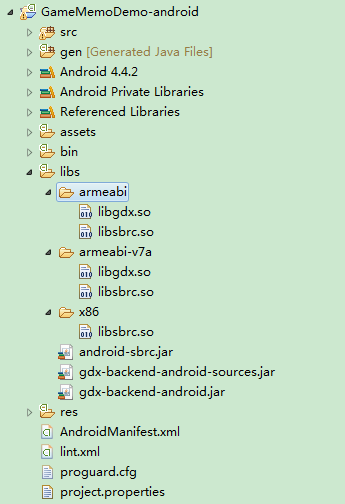

#开始使用

- order: 2
- category: hexlink

---
## SDK下载

[](../demo/android-sbrc-sdk-release-2015-03-05-2e0633d-with-demo.zip)

## SDK环境要求

android系统要求：接入SDK使用要求为 Android 4.1（API 15）或更高，使用 x86 或 ARMv7（不支持MIPS）。

JDK版本: 不低于 1.6 。

IDE要求：Eclipse with ADT 22.3 或更高，Android Studio 1.1 或更高。

## SDK接入方法

1. 解压android-sbrc-sdk。

2. 将 `libs/` 文件夹与项目目录的`libs/`文件夹合并。

3. 放置`android-sbrc.jar`：

 ant 项目置于 `libs/` 下。

 gradle项目置于 `app/libs/` 下,并在`build.gradle` 的dependency标签下加入:

        compile files('libs/android-sbrc.jar')

4. 将 `res/` 文件夹与项目目录的 `res/` 文件夹合并。

5. IDE 刷新后即可生效。



##更新AndroidManifest.xml

1. 在 `manifest` 标签下加入以下权限:

        <uses-permission android:name="android.permission.INTERNET" android:required="true"/>
        <uses-permission android:name="android.permission.ACCESS_WIFI_STATE" android:required="true"/>
        <uses-permission android:name="android.permission.CHANGE_WIFI_MULTICAST_STATE" android:required="true"/>
        <uses-permission android:name="android.permission.ACCESS_NETWORK_STATE" android:required="true"/>

2. 在 `application` 标签下加入以下service以确保你的应用可以在没有安装hexlink-tv端的设备上被手机发现。


        <service android:exported="false" android:name="hihex.sbrc.miniservices.SbrcService">
            <intent-filter>
                <action android:name="hihex.sbrc.services.SbrcService"/>
                <category android:name="hihex.sbrc.services.SbrcService"/>
            </intent-filter>
        </service>
        <activity android:name="hihex.sbrc.miniservices.PaymentWindowActivity"
            android:theme="@android:style/Theme.Translucent.NoTitleBar.Fullscreen"/>

 3.至此，SDK的接入已经完成。
## 一个简单的例子

```java

	package com.hihex.quickstartsbrc;

    import android.app.Activity;
    import android.graphics.Color;
    import android.os.Bundle;
    import android.util.Log;
    import android.view.View;
    import android.widget.FrameLayout;

    import java.util.Random;

    import hihex.sbrc.Client;
    import hihex.sbrc.ClientFactory;
    import hihex.sbrc.DisconnectReason;
    import hihex.sbrc.Identity;
    import hihex.sbrc.SbrcManager;
    import hihex.sbrc.events.PanEvent;
    import hihex.sbrc.events.PanState;


    public class MainActivity extends Activity {
        Activity activity;
        private FrameLayout mLayout;

        @Override
        protected void onCreate(Bundle savedInstanceState) {
            super.onCreate(savedInstanceState);
            activity = this;
            mLayout = new FrameLayout(this);
            mLayout.setBackgroundColor(0xffdddddd);
            setContentView(mLayout);

            //important!
            SbrcManager.instance.initialize(this);

            initSbrcClient();
        }

        private final void initSbrcClient() {
            final SbrcManager manager = SbrcManager.instance;

            // Set the client factory. This is used to generate clients for receiving events.
            manager.setClientFactory(new ClientFactory() {
                @Override
                public Client create() {
                    return new CustomClient(activity, mLayout);
                }
            });
        }

        @Override
        public void onDestroy() {
            super.onDestroy();
            SbrcManager.instance.destroy(this);
        }

        @Override
        protected void onPause() {
            super.onPause();
            SbrcManager.instance.pause();
        }

        @Override
        protected void onResume() {
            super.onResume();
            SbrcManager.instance.resume();
        }

        class CustomClient extends Client {
            private final FrameLayout mParent;
            private final View mView;
            private final FrameLayout.LayoutParams mLayoutParams;
            private final Activity mContext;
            private final Random mRng = new Random();

            public CustomClient(final Activity context, final FrameLayout layout) {
                mParent = layout;
                mContext = context;
                mView = new View(context);
                final int color = Color.HSVToColor(new float[]{mRng.nextFloat() * 360, 1, 1});
                mView.setBackgroundColor(color);
                mLayoutParams = new FrameLayout.LayoutParams(50, 50);
            }

            @Override
            public void onConnect(final Identity identity) {
                super.onConnect(identity);
                Log.d("sbrc", "onConnect:" + identity.toString());
                mContext.runOnUiThread(new Runnable() {
                    @Override
                    public void run() {
                        mLayoutParams.topMargin = 100;
                        mLayoutParams.leftMargin = 400;
                        mParent.addView(mView, mLayoutParams);
                    }
                });
                onIdentityUpdated(null, identity);
            }

            @Override
            public void onDisconnect(final Identity identity, final DisconnectReason reason) {
                super.onDisconnect(identity, reason);
                Log.d("sbrc", "onDisconnect:" + identity.toString());
            }

            @Override
            public void onPan(PanEvent panEvent) {
                Log.d("sbrc", "onPan:" + panEvent.toString());
                if (panEvent.state != PanState.kBegin) {
                    final float dx = panEvent.dx;
                    final float dy = panEvent.dy;
                    activity.runOnUiThread(new Runnable() {
                        @Override
                        public void run() {
                            mLayoutParams.leftMargin += dx;
                            mLayoutParams.topMargin += dy;
                            mView.setLayoutParams(mLayoutParams);
                        }
                    });
                }
            }
        }
    }

```

把上述代码复制到一个你的 `MainActivity.java` 文件中，然后就可以在电视上运行啦。试一下用手机连接并控制电视上面的色块运动吧。

---
## 更多手机与电视的交互

以上简单地给出了一个如何用手机操控电视的示例，但是 HexLink 本身不是一个只提供这些功能的解决方案，你还可以使用这一套 SDK 进行[游戏操控](/docs/control.html)，[电视支付](/docs/payment.html)。
